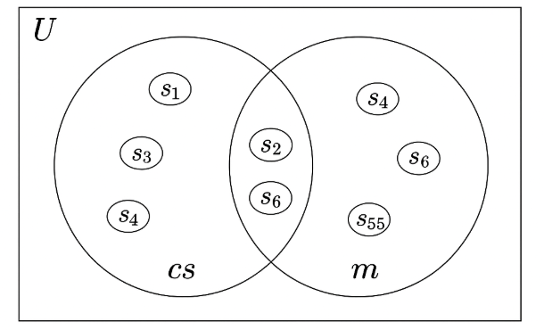

# Probability 

- Probability in simple words is what are the chances of particular event happening

- Example 
    - Consider dice from number (1 to 6) what are the chances of getting odd number on each throw
    
    - Here numbers {1,2,3,4,5,6} are consider as Sample space

    - Numbers {1,3,5} are events

    - Formula is (number of events) / (number of sample space) which is 3/6 or 0.5

    - So in percentage(%) we have 50% of chance getting odd number 

## Mathmatical sets for probability 

- Set in are some list object where each element is unique

- Example
    - We have sample student set (universal set in terms of set) as U = {s1,s2,s3,s4,s5,s6....s100}
    
    - Also we have 2 different set 
        - Student who learn computer science as cs = {s2,s5,s6} 
        - Student who learn math are m = {s1,s2,s3,s4,s6,s55}

    - Let 'N' be total number of student hence we can say
        - N(U) => Total number of student
        - N(cs) => Total cs student
        - N(m) => Total math student

    - Calculations    
        - now we can say N(total student with both subject) = N(cs) ∩ N(m) = {s2,s6} # Intersection
        - N(total studen who are stuying either of subject) = N(cs) + N(m) - (N(cs) ∩ N(m)) # union
        - which will be N(cs U m) = {s1,s2,s3,s4,s5,s6,s55}
        - Note : why we need to remove intersection ? as there are common student who learn both are counted, student who study math also study cs
        - N(cs ∩ m) ⊆ N(cs U m) ⊆ N(U)

 

  
